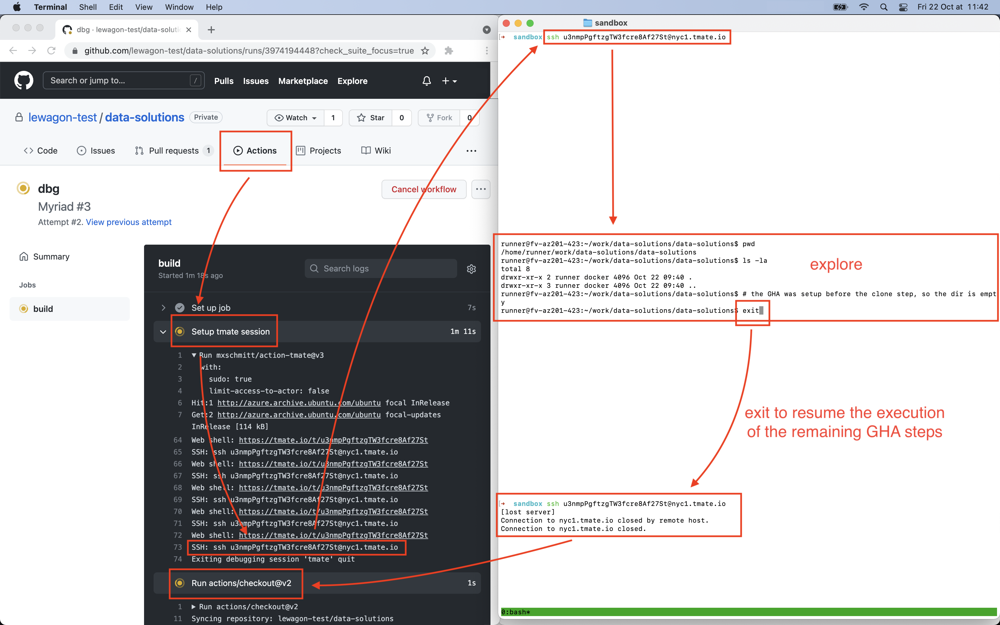

# Le Wagon GHA worflow templates

## Available templates

- [`clean-metadata`](/workflow-templates/clean-metadata.yml), a metadata cleaner for notebooks
- [`readmes-checker`](/workflow-templates/readmes-checker.yml), a [check](https://docs.github.com/en/rest/reference/checks) for presence of `README.md` file in challenges directories

## Debugging a GHA

[tmate](https://github.com/mxschmitt/action-tmate) provides a GHA step allowing to connect remotely to the container running the GHA in order to explore it

The *tmate* step will run until a SSH remote connection is established and then closed, or once the 360mn GHA execution timeout is reached

In order to use *tmate*:

1. Add the *tmate* step to a GHA

``` yaml
    - name: Setup tmate session
      uses: mxschmitt/action-tmate@v3
```

2. Run the GHA

3. Go to GitHub and open the [Actions tab of the running GHA](https://github.com/lewagon-test/data-solutions/actions)

4. *tmate* provides the instructions to connect to the GHA container when the *tmate* step is running

At this moment *tmate* will wait until a connection is opened

``` bash
Reading package lists...
Reading package lists...
Building dependency tree...
Reading state information...
openssh-client is already the newest version (1:8.2p1-4ubuntu0.3).
xz-utils is already the newest version (5.2.4-1ubuntu1).
0 upgraded, 0 newly installed, 0 to remove and 22 not upgraded.
Created new session successfully
ssh u3nmpPgftzgTW3fcre8Af27St@nyc1.tmate.io
https://tmate.io/t/u3nmpPgftzgTW3fcre8Af27St
Entering main loop
Web shell: https://tmate.io/t/u3nmpPgftzgTW3fcre8Af27St
SSH: ssh u3nmpPgftzgTW3fcre8Af27St@nyc1.tmate.io
Web shell: https://tmate.io/t/u3nmpPgftzgTW3fcre8Af27St
SSH: ssh u3nmpPgftzgTW3fcre8Af27St@nyc1.tmate.io
Web shell: https://tmate.io/t/u3nmpPgftzgTW3fcre8Af27St
SSH: ssh u3nmpPgftzgTW3fcre8Af27St@nyc1.tmate.io
```

👆 Copy the ssh command from the GHA logs

5. Open a terminal and paste the SSH connection command

``` bash
ssh u3nmpPgftzgTW3fcre8Af27St@nyc1.tmate.io
```

6. Hit **q** to skip the message

``` bash
Tip: if you wish to use tmate only for remote access, run: tmate -F                                               [0/0]
To see the following messages again, run in a tmate session: tmate show-messages
Press <q> or <ctrl-c> to continue
---------------------------------------------------------------------
Connecting to ssh.tmate.io...
Note: clear your terminal before sharing readonly access
web session read only: https://tmate.io/t/ro-B2K64jJamLht9vpeQsTzFjW9n
ssh session read only: ssh ro-B2K64jJamLht9vpeQsTzFjW9n@nyc1.tmate.io
web session: https://tmate.io/t/gpBVqeNuKWguT8njkhyjznJyy
ssh session: ssh gpBVqeNuKWguT8njkhyjznJyy@nyc1.tmate.io
A mate has joined (88.160.245.54) -- 1 client currently connected
```

7. Explore the running container 🍿

8. Once you are done, exit the SSH connection in order to resume the execution of the remaining GHA steps

``` bash
exit
```


